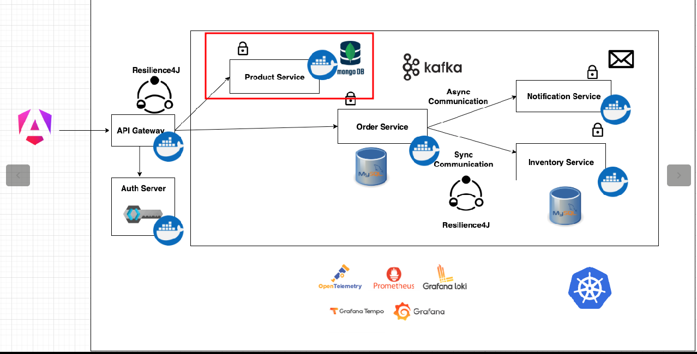

# Spring Boot Microservices - Product Service

Este repositório contém o código de um serviço de produtos desenvolvido com Spring Boot.

## Tecnologias
- Java 17
- Spring Boot 3.3.5
- MongoDB
- Test Containers
- Docker

## Executando o projeto
Para executar o projeto, é necessário ter o Docker instalado na máquina para iniciar o serviço de banco de dados. Com o Docker instalado, execute o comando abaixo na raiz do projeto:

```shell
docker compose up -d
```
ou

```shell
docker-compose up -d
```
## Arquitetura

A imagem abaixo representa a arquitetura do projeto, em destaque está o serviço de produtos.

